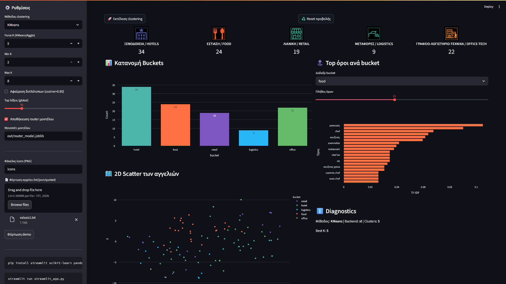
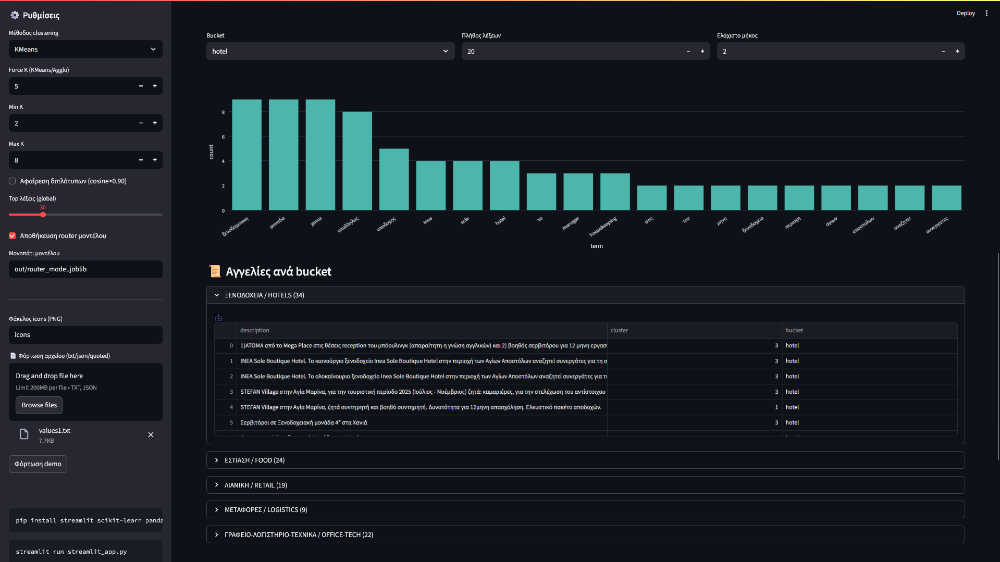
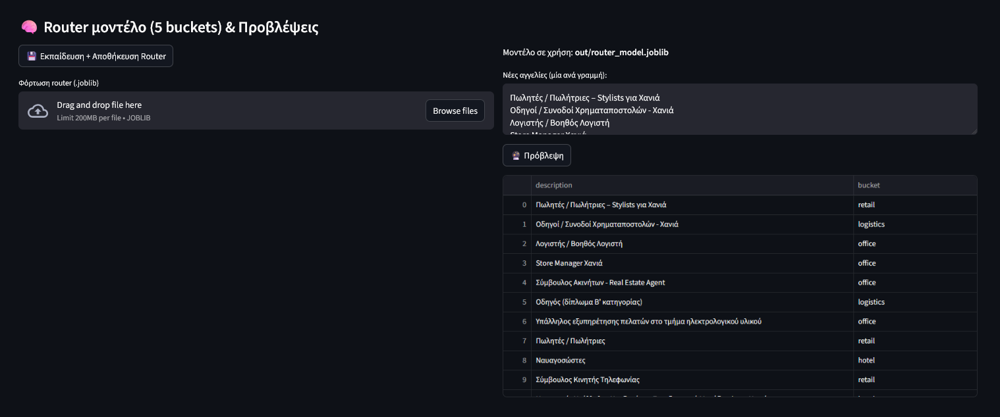

# 1. Greek Job Ads Clustering & Sector Prediction

Interactive Streamlit dashboard that clusters Greek job listings into 5 sectors and predicts the sector of new listings.

- App code: `streamlit_app.py`
- Screenshots: `Screenshots/Dashboard.png`, `Screenshots/Bucket.png`, `Screenshots/Predictions.png`

<p align="center">
  
</p>

---

# 2. What this app does

1. **Unsupervised clustering** of job ads using sentence embeddings or TF-IDF, with three options:
   - **HDBSCAN** (with UMAP reduction)
   - **K-Means** (with t-SNE visualization)
   - **Agglomerative** (average linkage, cosine)
2. **Rule-based routing** to 5 business buckets:
   - `hotel`, `food`, `retail`, `logistics`, `office`
3. **Supervised router** (optional) to predict the bucket of **new** job ads.
4. **Explainers**:
   - Top TF-IDF terms per bucket
   - Word frequency bars per bucket
   - 2D scatterplot of listings
5. **Persistence**:
   - Saves embeddings and a trained router model (`.joblib`) for reuse.

---

# 3. Quickstart

## 3.1 Prerequisites
- Python 3.10+
- Windows CMD commands below

## 3.2 Setup
```cmd
python -m venv .venv
.venv\Scripts\activate

pip install streamlit scikit-learn pandas numpy plotly joblib umap-learn hdbscan sentence-transformers pillow
```

## 3.3 Run
```cmd
streamlit run streamlit_app.py
```

## 3.4 Icons
Put PNG icons in `icons/` with these names:
```
icons/hotel.png
icons/food.png
icons/retail.png
icons/logistics.png
icons/office.png
```

---

# 4. How to use

1. Paste job listings (one per line) or upload a `.txt/.json` file from the sidebar.
2. Click **🚀 Εκτέλεση clustering**.
3. Explore:
   - **Bucket Distribution** with large centered icons.
   - **Top terms per bucket** (select a bucket and N terms).
   - **Word frequency** bars per bucket.
   - **2D Scatter** of the listings.


 <p align="center">
  
</p>


4. Train and save the **router** model:
   - Click **💾 Εκπαίδευση + Αποθήκευση Router** → saves to `out/router_model.joblib`.

5. Predict on **new** job descriptions:
   - Paste new lines in the **Νέες αγγελίες** box.
   - Click **🔮 Πρόβλεψη**.  
   - Predictions combine hard rules and the trained router.


<p align="center">
  
</p>

---

# 5. Data pipeline

## 5.1 Preprocessing
- Lowercasing, accent stripping, removal of emails/phones/numbers and non-alphanumerics.
- Domain stop-words (Greek recruiter boilerplate) + custom stop-words:
  - `{"αγια","μαρινα","boutique"}` are removed to avoid location/brand artifacts.
- Normalization keeps tokens compatible with the stop-word list.

Let \( d \) be a document, \( t \) a term. We compute TF-IDF with:
\[
\mathrm{tfidf}(t,d) = \mathrm{tf}(t,d)\cdot \log\frac{N}{\mathrm{df}(t)+1}
\]
where \(N\) is the corpus size.

## 5.2 Vectorization
- **Primary**: multilingual MiniLM sentence embeddings  
  `sentence-transformers/paraphrase-multilingual-MiniLM-L12-v2` (L2-normalized).
- **Fallback**: TF-IDF on unigrams+bigrams.  
  For tiny corpora (≤2 docs) we set `max_df=1.0` to avoid `max_df<min_df`.

## 5.3 Clustering
Choose one:

- **HDBSCAN** over **UMAP** embeddings  
  - UMAP: cosine metric, `n_neighbors=12`, `n_components=15`.  
  - HDBSCAN: `min_cluster_size=3`, `min_samples=1`, `cluster_selection_method="leaf"`.  
  No need to predefine K. Noise labeled `-1`.

- **K-Means**  
  - Silhouette screening across `K∈[min_k,max_k]` then refit with best K.  
  - Visualization via t-SNE on standardized features.

- **Agglomerative**  
  - Average linkage with cosine distance.  
  - K selected by max silhouette.

**Silhouette** for a sample \(i\):
\[
s(i)=\frac{b(i)-a(i)}{\max\{a(i),b(i)\}}
\]
where \(a(i)\) is mean intra-cluster distance and \(b(i)\) the best alternative cluster distance.

## 5.4 Bucket routing (deterministic)
Hard substring rules map texts to sector buckets. Examples:
- `hotel`: “ξενοδοχ”, “housekeeping”, “reception”, …
- `food`: “σερβιτ”, “κουζιν”, “chef”, “barista”, …
- etc.

If rules are silent, we choose the bucket with the most rule hits on the cleaned text.

## 5.5 Supervised router (optional)
We train a **Logistic Regression** classifier on **character n-grams** (3–5) of the normalized text:
- Features: `TfidfVectorizer(analyzer="char_wb", ngram_range=(3,5))`
- Targets: the 5 buckets from the rule-based router on the current dataset
- Reported with **stratified K-fold** macro-F1 for a sanity check
- Saved to `out/router_model.joblib`

At prediction time:
1. If a hard rule matches, we take that bucket.
2. Otherwise, we use the router’s prediction.

## 5.6 Visual explainers
- **Top TF-IDF terms per bucket**: mean TF-IDF centroid per bucket, top-N terms.
- **Word frequency** per bucket: token counts after normalization and stop-word removal.
- **2D scatter**: UMAP or t-SNE projection, colored by bucket.

---

# 6. File outputs

- `out/clustered_with_buckets.csv` – listing → cluster id → bucket
- `out/cluster_top_terms.csv` – top terms per discovered cluster
- `out/embeddings.npy`, `out/embed_meta.json` – cached embeddings
- `out/router_model.joblib` – saved router model

---

# 7. Predict-only mode for tiny inputs

If you paste fewer than 3 listings, the app skips clustering and performs **routing + model prediction** only. This avoids TF-IDF edge cases when `max_df < min_df`.

---

# 8. Clearing cache and resetting

If stale results appear:

```cmd
streamlit cache clear
```

Or use the app buttons:
- **♻️ Reset προβολής** to drop session state.
- Optional “🧹 Hard reset” can clear `st.cache_data` and rerun.

Artifacts can be removed via:
```cmd
del /q out\*
```

---

# 9. Limitations

- Rule substrings are heuristic; domain drift requires maintenance.
- Clustering quality depends on corpus size and topical diversity.
- Router labels inherit noise from rule routing; consider manual curation for production.

---

# 10. License

MIT. See `LICENSE`.

---

# 11. Citation

If you use this project in academic or industrial work, cite:
- McInnes et al. (2017) **HDBSCAN**
- McInnes et al. (2018) **UMAP**
- van der Maaten & Hinton (2008) **t-SNE**
- Reimers & Gurevych (2019) **Sentence-BERT**
